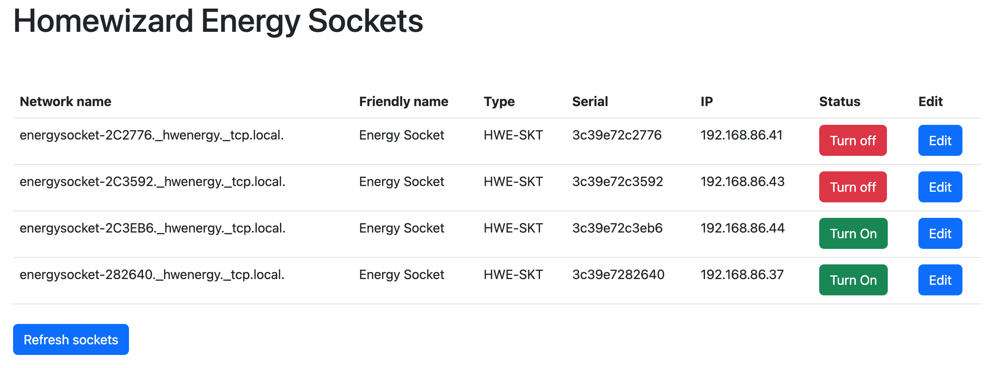

# Homewizard Energy Socket Unified API and Manager. 

## Getting started

This project is a unified API and manager for the Homewizard Energy Socket. It is based on the Homewizard Energy Socket API. 
Running this requires Docker Host mode, which only runs on Linux. To run on macOS and windows you need to run it manually, 
and install celery and redis yourself.

## Build and run

Building the docker images yourself:

```bash
git clone git@gitlab.com:barry-daniels/energy-socket-manager.git
cd energy-socket-manager
docker-compose build 
docker-compose up -d
```

On startup the docker image will look for new sockets and store them in the local database. This takes 10 seconds after 
which the webinterface will be available on port 8000. 

**Note:**
Running in host mode is required to be able to detect the Homewizard Energy Sockets. This only works on linux hosts for now. 
To run on another platform you need to run the application outside of docker. 

## Running manually with virtual enviroment (MacOS)

```bash
git clone git@gitlab.com:barry-daniels/energy-socket-manager.git
cd energy-socket-manager
python3 -m venv venv
source venv/bin/activate
pip install -r requirements/base.txt
python manage.py migrate
python manage.py runserver 0.0.0.0:8000 &
celery -A energy worker -l info &
```

## Running manually with virtual enviroment (Windows)

```bash
git clone git@gitlab.com:barry-daniels/energy-socket-manager.git
cd energy-socket-manager
python3 -m venv venv
venv\Scripts\activate.bat
pip install -r requirements\base.txt
python manage.py migrate
start /b python manage.py runserver 0.0.0.0:8000
start /b celery -A energy worker -l info
```


## Name
Homewizard Energy Socket Unified API and Manager. 

## Description
Homewizard energy sockets expose a API on port 80. To combine all these sockets in one API i created this project.

## Visuals
**Webinterface - List Sockets**

**Webinterface - Edit Sockets**


## Usage

### Webinterface
http://IP:8000/

### API / Webhooks

**List all sockets**
```bash    
http://IP:8000/api/sockets
```

**Find new sockets**
```bash
http://IP:8000/api/sockets/new
```

**Refresh all sockets status**
```bash
http://IP:8000/api/sockets/update
```

**Update socket status**
```bash
http://IP:8000/api/sockets/status/<int:id>/<str:status>

# Example
http://localhost:8000/api/socket/status/1/on
```


